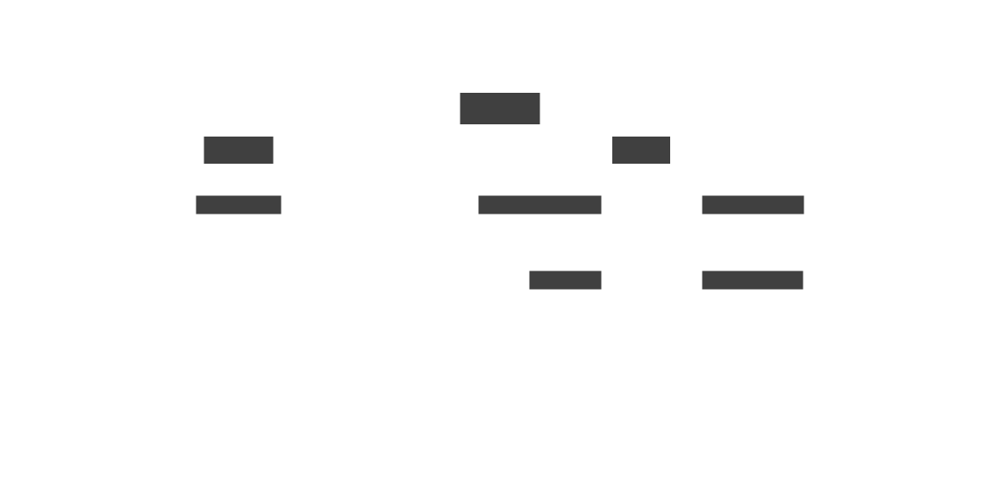

# Grafana OnCall Act-Kit

Welcome to the OnCall Act-Kit! This repository offers a collection of terraform
files to get started with managing your OnCall duties as code. Changes are
automatically applied using GitHub Actions.

To use this repository:

1. Fork it to your organization or personal namespace
1. Take a look at the terraform files to adapt them to your needs
1. Set the environment variables to your values:
    + `TF_VAR_grafana_access_token`
    + `TF_VAR_oncall_access_token`
    + `TF_VAR_oncall_url=`
    + `TF_VAR_grafana_url`

    This needs to be done in your respective CI settings or your local env if
    you're running this from your machine.

## How it works

The OnCall infrastructure managed by this repository manages the following components:

* The `Contact Point` is part of Grafana Alerting and sends alerts to OnCall as soon as they fire
* The `Grafana Integration` inside of OnCall receives the alerts from the `Contact Point`. It also enriches the alert with templates.
* The `Escalation Chain` defines how issues should be escalated. By default, this will just notify the current user on call using their preferred way of notification.
* The `OnCall Schedule` is the source of truth on which user is on call at what time. You can choose between a `simple` rotation (users rotate weekly) or a follow-the-sun `time-based` rotation which is optimized for distributed teams.
