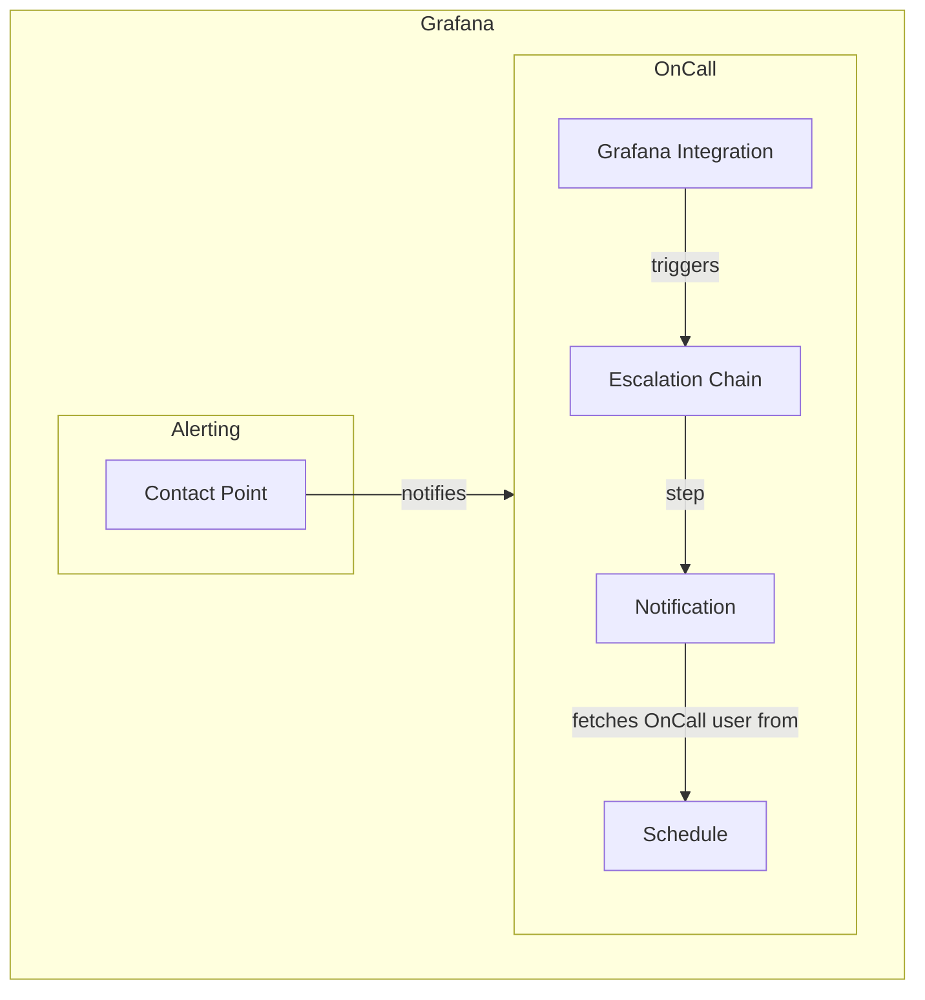

# Grafana OnCall Act-Kit

Welcome to the OnCall Act-Kit! This repository offers a collection of terraform
files to get started with managing your OnCall duties as code. Changes are
automatically applied using GitHub Actions.

## Using this repository
To use this repository:

1. Fork it to your organization or personal namespace
1. **Important** modify the Terraform backend in `main.tf` to use your prefered state store
1. Take a look at the terraform files to adapt them to your needs
1. Set the environment variables to your values:
    + `TF_VAR_grafana_access_token`
    + `TF_VAR_oncall_access_token`
    + `TF_VAR_oncall_url`
    + `TF_VAR_grafana_url`

    This needs to be done in your respective CI settings or your local env if
    you're running this from your machine.

## Module structure

The `main.tf` file is the main entrypoint for the configuration.
This file contains:

* The Terraform Provider & Backend configuration
* The connection information for Grafana & OnCall
* A module directive for importing the active schedule.

We provide you with two different schedules as starting points:
* [simple-rotation](./schedules/simple-rotation): A schedule rotating the person on call weekly
* [timezone-based-rotation](./schedules/timezone-based-rotation): A schedule using timezone offsets to prevent anyone being on call over night

Refer to the `README.md` file of the respective schedules for more information.

The escalation chain describes how to handle an alert once received by OnCall.
It is configured in the [`escalation.tf`](./escalation.tf) file.
The default is to notify the person currently on call.
This information is taken from the previously defined schedule.
Check out the [Terraform provider documenation](https://registry.terraform.io/providers/grafana/grafana/latest/docs/resources/oncall_escalation) for possible escalation steps.

The [`integration.tf`](./integration.tf) file contains the resources needed to connect the Grafana alerting system with OnCall.
It configures the Grafana notification policy to send all alerts to OnCall.
You should not have to modify anything in this file.

Below you can find a visualization of the way the alert flows through the system

